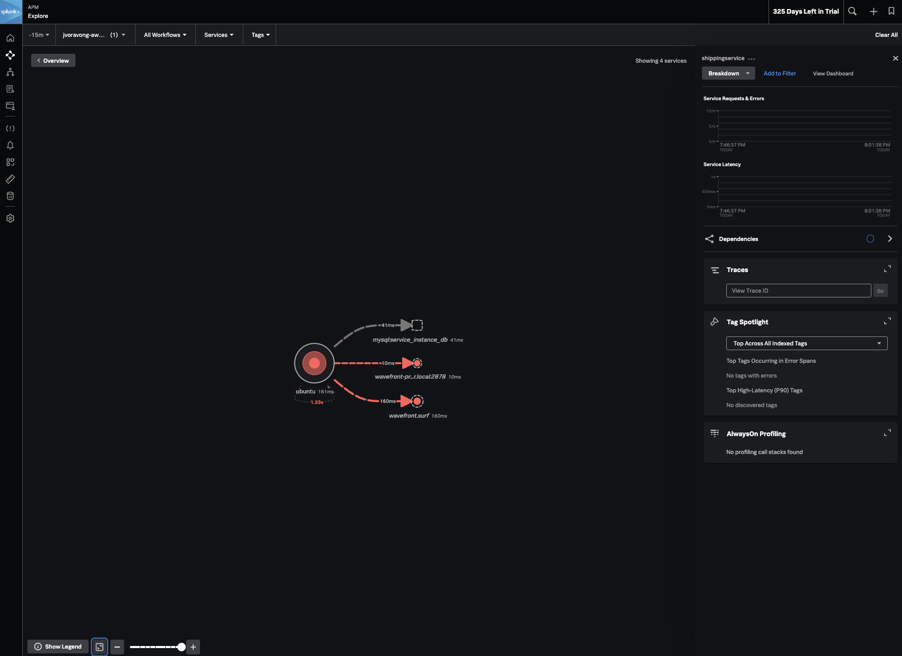

# Example of chart configuration

## **⚠ WARNING: This project is Alpha.**

### Please do not use in production. Things will break without notice.

## How to deploy the OpenTelemetry Operator and auto-instrumentation

The OpenTelemetry Operator is an implementation of a [Kubernetes Operator](https://coreos.com/operators/).

## Getting started
### 1. If [cert-manager](https://cert-manager.io/docs/) is not already deployed and available to this operator, then deploy it.

```
kubectl apply -f https://github.com/jetstack/cert-manager/releases/download/v1.5.2/cert-manager.yaml
```

The cert-manager adds certificates and certificate issuers as resource types in Kubernetes clusters, and simplifies the process of obtaining, renewing and using those certificates.

### 2. Deploy the Helm Chart with the Operator Enabled

TODO: Add helm install command here

### 3. Setup spring-petclinic example

https://github.com/signalfx/splunk-otel-collector-operator/tree/main/examples/autoinstrumentation-java-spring-petclinic

### 4. Verify everything is deployed right

kubectl get pods -n spring-petclinic
NAME                                 READY   STATUS    RESTARTS      AGE
api-gateway-94b56b968-l992w          1/1     Running   0             15m
customers-db-mysql-0                 1/1     Running   0             15m
customers-service-7898648d85-xp6q4   1/1     Running   0             15m
vets-db-mysql-0                      1/1     Running   0             15m
vets-service-5d6b88744f-5rtvp        1/1     Running   0             15m
visits-db-mysql-0                    1/1     Running   0             15m
visits-service-56795b6965-ss855      1/1     Running   0             15m
wavefront-proxy-84b7d4d6f4-snpz4     1/1     Running   0             15m

### 5. Deploy the instrumentation resource

kubectl apply -f ./examples/enable-operator-and-auto-instrumentation/instrumentation-java.yaml -n spring-petclinic

### 6. Instrument the pet clinic apps by setting this annotation

kubectl patch deployment api-gateway -p '{"spec": {"template":{"metadata":{"annotations":{"instrumentation.opentelemetry.io/inject-java":"true"}}}} }' -n spring-petclinic
kubectl patch deployment customers-service -p '{"spec": {"template":{"metadata":{"annotations":{"instrumentation.opentelemetry.io/inject-java":"true"}}}} }' -n spring-petclinic
kubectl patch deployment vets-service -p '{"spec": {"template":{"metadata":{"annotations":{"instrumentation.opentelemetry.io/inject-java":"true"}}}} }' -n spring-petclinic
kubectl patch deployment visits-service -p '{"spec": {"template":{"metadata":{"annotations":{"instrumentation.opentelemetry.io/inject-java":"true"}}}} }' -n spring-petclinic
kubectl patch deployment wavefront-proxy -p '{"spec": {"template":{"metadata":{"annotations":{"instrumentation.opentelemetry.io/inject-java":"true"}}}} }' -n spring-petclinic

# If you need to reset the instrumentation action, use can use these
kubectl patch deployment api-gateway -p '{"spec": {"template":{"metadata":{"annotations":{"instrumentation.opentelemetry.io/inject-java":"false"}}}} }' -n spring-petclinic
kubectl patch deployment customers-service -p '{"spec": {"template":{"metadata":{"annotations":{"instrumentation.opentelemetry.io/inject-java":"false"}}}} }' -n spring-petclinic
kubectl patch deployment vets-service -p '{"spec": {"template":{"metadata":{"annotations":{"instrumentation.opentelemetry.io/inject-java":"false"}}}} }' -n spring-petclinic
kubectl patch deployment visits-service -p '{"spec": {"template":{"metadata":{"annotations":{"instrumentation.opentelemetry.io/inject-java":"false"}}}} }' -n spring-petclinic
kubectl patch deployment wavefront-proxy -p '{"spec": {"template":{"metadata":{"annotations":{"instrumentation.opentelemetry.io/inject-java":"false"}}}} }' -n spring-petclinic

# 7. Go to https://app.signalfx.com/#/home and Observe



