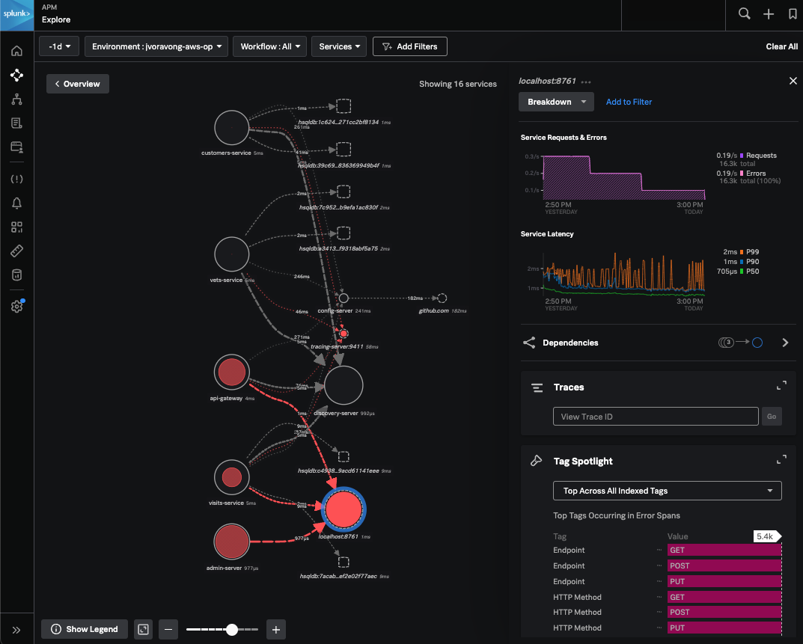
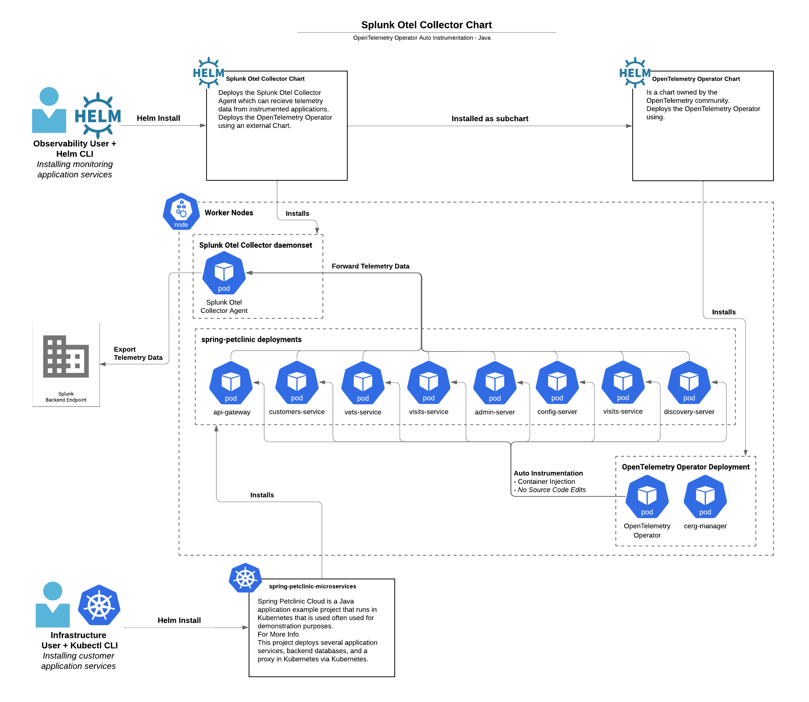

# Example of chart configuration

## How to deploy the OpenTelemetry Operator and Java auto-instrumentation

In the following example we will show how to instrument
[spring-petclinic-microservices](https://github.com/spring-petclinic/spring-petclinic-microservices).

## Getting started
### 1. If the common [cert-manager](https://cert-manager.io/docs/installation/kubectl/) is not already deployed and available in the cluster, then deploy it.

If the cert-manager was already installed, you'd likely find it in the
cert-manager namespace.'

```
kubectl get pods -n cert-manager
# NAME                                       READY   STATUS    RESTARTS   AGE
# cert-manager-6b466d8fb4-njt5n              1/1     Running   0
5h26m```


```

If it does need to be installed, run this.

```
kubectl apply -f https://github.com/cert-manager/cert-manager/releases/download/v1.10.2/cert-manager.yaml
```

The cert-manager adds certificates and certificate issuers as resource types in Kubernetes clusters, and simplifies the process of obtaining, renewing and using those certificates.

### 2. Deploy the Helm Chart with the Operator Enabled

```
 helm install splunk-otel-collector \
 -f examples/enable-operator-and-auto-instrumentation/enable-operator-and-auto-instrumentation-values.yaml \
 -n monitoring \
 helm-charts/splunk-otel-collector
 ```

### 3. Setup spring-petclinic example

TODO: Add the Kubernetes manifests for spring-petclinic to this example in followup PR
```
kubectl apply -f examples/enable-operator-and-auto-instrumentation/spring-petclinic -R
```

### 4. Verify all the example collector and spring-petclinic resources are deployed successfully

```
kubectl  get pods -n monitoring
# NAME                                                          READY
# STATUS    RESTARTS   AGE
# splunk-otel-collector-agent-9ccgn                             2/2     Running   0          38m
# splunk-otel-collector-agent-ft4xc                             2/2     Running   0          38m
# splunk-otel-collector-k8s-cluster-receiver-56f7c9cf5b-mgsbj   1/1     Running   0          38m
# splunk-otel-collector-operator-6dffc898df-5jjkp               2/2     Running   0          38m

kubectl get mutatingwebhookconfiguration.admissionregistration.k8s.io -n monitoring
# NAME                                      WEBHOOKS   AGE
# cert-manager-webhook                      1          8m
# splunk-otel-collector-operator-mutation   3          2m

kubectl get pods -n spring-petclinic
# NAME                                READY   STATUS    RESTARTS        AGE
# admin-server-75d7f4b777-kwq74       1/1     Running   0               2m
# api-gateway-649cc9c68c-9g85j        1/1     Running   0               2m
# config-server-6f7dc87c5f-l8wf5      1/1     Running   0               2m
# customers-service-64c4f875d-m5m64   1/1     Running   0               2m
# discovery-server-65b6d569d6-pf9t6   1/1     Running   0               2m
# vets-service-89b55685c-m9pp5        1/1     Running   0               2m
# visits-service-9689c7b96-k4nm2      1/1     Running   0               2m
```

### 5. Deploy the Kubernetes Instrumentation object

```
kubectl apply -f examples/enable-operator-and-auto-instrumentation/instrumentation-java.yaml -n spring-petclinic
```

### 6. Instrument the spring-petclinic apps by setting this annotation
An _inject instrumentation_ annotation can be added to the following.
- Namespace: All pods within that namespace will be instrumented.
- Pod Spec Objects: PodSpec objects that are available as part of Deployment,
  Statefulset, or other resources can be annotated.
following values.
- "true" - inject and Instrumentation resource from the namespace.
- "my-instrumentation" - name of Instrumentation CR instance in the current
namespace.
- "my-other-namespace/my-instrumentation" - name and namespace of.
Instrumentation CR instance in another namespace.
- "false" - do not inject.

Run these commands to add the annotation, the pods created by spring-petclinic
deployments, the related pods will be restarted with instrumentation injected.
```
kubectl patch deployment admin-server  -p '{"spec": {"template":{"metadata":{"annotations":{"instrumentation.opentelemetry.io/inject-java":"true"}}}} }' -n spring-petclinic
kubectl patch deployment api-gateway -p '{"spec": {"template":{"metadata":{"annotations":{"instrumentation.opentelemetry.io/inject-java":"true"}}}} }' -n spring-petclinic
kubectl patch deployment config-server -p '{"spec": {"template":{"metadata":{"annotations":{"instrumentation.opentelemetry.io/inject-java":"true"}}}} }' -n spring-petclinic
kubectl patch deployment customers-service -p '{"spec": {"template":{"metadata":{"annotations":{"instrumentation.opentelemetry.io/inject-java":"true"}}}} }' -n spring-petclinic
kubectl patch deployment vets-service -p '{"spec": {"template":{"metadata":{"annotations":{"instrumentation.opentelemetry.io/inject-java":"true"}}}} }' -n spring-petclinic
kubectl patch deployment discovery-server -p '{"spec": {"template":{"metadata":{"annotations":{"instrumentation.opentelemetry.io/inject-java":"true"}}}} }' -n spring-petclinic
kubectl patch deployment visits-service -p '{"spec": {"template":{"metadata":{"annotations":{"instrumentation.opentelemetry.io/inject-java":"true"}}}} }' -n spring-petclinic
```

If you need to disable the instrumentation, add these annotations.
```
kubectl patch deployment admin-server  -p '{"spec": {"template":{"metadata":{"annotations":{"instrumentation.opentelemetry.io/inject-java":"false"}}}} }' -n spring-petclinic
kubectl patch deployment api-gateway -p '{"spec": {"template":{"metadata":{"annotations":{"instrumentation.opentelemetry.io/inject-java":"false"}}}} }' -n spring-petclinic
kubectl patch deployment config-server -p '{"spec": {"template":{"metadata":{"annotations":{"instrumentation.opentelemetry.io/inject-java":"false"}}}} }' -n spring-petclinic
kubectl patch deployment customers-service -p '{"spec": {"template":{"metadata":{"annotations":{"instrumentation.opentelemetry.io/inject-java":"false"}}}} }' -n spring-petclinic
kubectl patch deployment vets-service -p '{"spec": {"template":{"metadata":{"annotations":{"instrumentation.opentelemetry.io/inject-java":"false"}}}} }' -n spring-petclinic
kubectl patch deployment discovery-server -p '{"spec": {"template":{"metadata":{"annotations":{"instrumentation.opentelemetry.io/inject-java":"false"}}}} }' -n spring-petclinic
kubectl patch deployment visits-service -p '{"spec": {"template":{"metadata":{"annotations":{"instrumentation.opentelemetry.io/inject-java":"false"}}}} }' -n spring-petclinic
```

# 7. Check out the results at [Splunk Observability APM](tps://app.signalfx.com/#/apm)

The trace and metrics data should populate the APM dashboard and looking
similar to this image.



To better visualize this example as a whole, we have included the diagram below
show how everything is set up.


